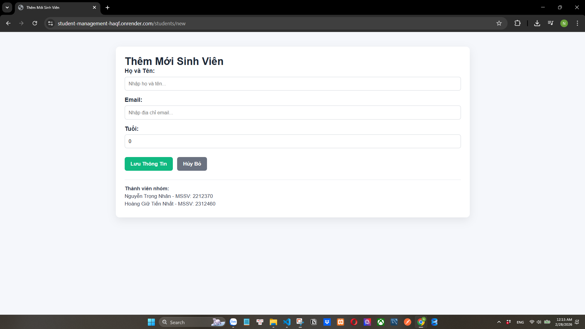

# Student Management System

## Thông tin nhóm

- Nguyễn Trọng Nhân - MSSV: 2212370
- Hoàng Giữ Tiến Nhất - MSSV: 2312460

## URL Web Service:

https://student-management-haqf.onrender.com/students

## Lab 1 - Câu hỏi & trả lời

### Câu 3. Toàn vẹn dữ liệu (Constraints)

**Câu hỏi:**

- Thử Insert một sinh viên nhưng bỏ trống cột `name` (để `NULL`).
- Database có báo lỗi không? Từ đó suy nghĩ xem sự thiếu chặt chẽ này ảnh hưởng gì khi code Java đọc dữ liệu lên?

**Trả lời:**

- Với cấu hình hiện tại của project, cột `name` được map với `@Column(nullable = false)` và có validation `@NotBlank`, nên khi insert `name = NULL` thì hệ thống sẽ báo lỗi vi phạm ràng buộc (bị chặn ở tầng app hoặc DB).
- Nếu không có ràng buộc chặt, dữ liệu `NULL` vẫn có thể lọt vào database và gây:
  - Hiển thị thiếu dữ liệu trên UI.
  - Lỗi logic nghiệp vụ (search/sort theo tên không chính xác).
  - Dễ phát sinh `NullPointerException` khi xử lý ở Java.
  - Khó bảo trì và làm sạch dữ liệu về sau.

=> Cần đảm bảo ràng buộc ở cả tầng Database và tầng Application.

### Câu 4. Cấu hình Hibernate

**Câu hỏi:**

- Tại sao mỗi lần tắt ứng dụng và chạy lại, dữ liệu cũ trong Database lại bị mất hết?

**Trả lời:**

- Nguyên nhân thường do cấu hình `spring.jpa.hibernate.ddl-auto` đang để chế độ như `create` hoặc `create-drop`:
  - `create`: mỗi lần start app sẽ tạo lại bảng.
  - `create-drop`: tạo khi start và xóa khi shutdown.
- Vì vậy dữ liệu cũ bị mất sau mỗi lần chạy lại.

## 1) Yêu cầu môi trường

- Java 17
- Maven 3.9+
- PostgreSQL

## 2) Cấu hình database PostgreSQL

File cấu hình hiện tại: `src/main/resources/application.properties`

```properties
spring.datasource.url=jdbc:postgresql://localhost:5432/studentdb
spring.datasource.username=postgres
spring.datasource.password=pass123
```

Tạo database trước khi chạy:

```sql
CREATE DATABASE studentdb;
```

## 3) Cách chạy dự án

### Cách 1: dùng Maven cài sẵn

```bash
mvn spring-boot:run
```

### Cách 2: dùng Maven Wrapper

```bash
./mvnw spring-boot:run
```

Trên Windows (PowerShell):

```powershell
.\mvnw.cmd spring-boot:run
```

Ứng dụng chạy tại:

- REST API: `http://localhost:8080/api/students`
- SSR Thymeleaf page: `http://localhost:8080/students`

---

## 4) Full set of curl commands (CRUD)

> Lưu ý: `id` hiện dùng kiểu `UUID` và được **tự động sinh** khi tạo mới.
> Vì vậy khi `POST /api/students` bạn **không cần truyền id**.

Base URL:

```bash
http://localhost:8080/api/students
```

### 4.1 Create student (POST)

```bash
curl -X POST http://localhost:8080/api/students \
  -H "Content-Type: application/json" \
  -d "{\"name\":\"Nguyen Van A\",\"email\":\"a@gmail.com\",\"age\":20}"
```

Tạo thêm 1 sinh viên:

```bash
curl -X POST http://localhost:8080/api/students \
  -H "Content-Type: application/json" \
  -d "{\"name\":\"Tran Thi B\",\"email\":\"b@gmail.com\",\"age\":21}"
```

### 4.2 Get all students (GET)

```bash
curl -X GET http://localhost:8080/api/students
```

Sau khi tạo, lấy `id` UUID từ response JSON và thay vào `${UUID}` trong các lệnh bên dưới.

### 4.3 Get student by id (GET)

```bash
curl -X GET http://localhost:8080/api/students/${UUID}
```

### 4.4 Update student (PUT)

```bash
curl -X PUT http://localhost:8080/api/students/${UUID} \
  -H "Content-Type: application/json" \
  -d "{\"name\":\"Nguyen Van A Updated\",\"email\":\"a.updated@gmail.com\",\"age\":22}"
```

### 4.5 Delete student (DELETE)

```bash
curl -X DELETE http://localhost:8080/api/students/${UUID}
```

### 4.6 Verify delete (GET after delete)

```bash
curl -X GET http://localhost:8080/api/students/${UUID}
```

Kỳ vọng: trả về `404 Not Found`.

---

## 5) (Tuỳ chọn) Test validation nhanh

### Age <= 0 (400)

```bash
curl -X POST http://localhost:8080/api/students \
  -H "Content-Type: application/json" \
  -d "{\"name\":\"Invalid Age\",\"email\":\"invalid@gmail.com\",\"age\":0}"
```

### Name rỗng (400)

```bash
curl -X POST http://localhost:8080/api/students \
  -H "Content-Type: application/json" \
  -d "{\"name\":\"\",\"email\":\"noname@gmail.com\",\"age\":19}"
```

## Screenshot các module lab 4:

### Trang hiển thị toàn bộ danh sách sinh viên


### Xem chi tiết sinh viên


### Xóa sinh viên


### Trang thêm mới sinh viên



### Trang chỉnh sửa


